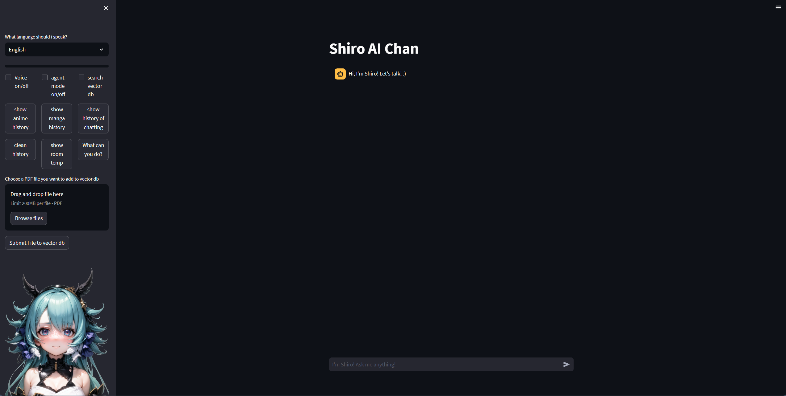

# 1. ShiroAi-chan comfy on Streamlit

### My attempt to create my anime waifu assistant that can write and speak in cute voice.

### Description:
My personal Ai assistant ShiroAi-chan. I wanted to create AI girl from a long time and now with really cheap and powerful model like [ChatGPT API] it's possible for anyone.

### Her personality
* She is virtual cat-girl that likes anime, manga, light novels and games. (I wrote it for my preferences, but it can be changed easily). I am using tables as her 'personalities', for example, 'normal' is just her basic character description, but I can add personality like 'programmer god' in which she will be helping in programming problems. Personalities are just another role in prompt to [ChatGPT API].

### GUI

## What she can do?
### 1. Writing
* She uses [ChatGPT API] to generate responses as AI neko girl.

### 2. Her memory :heart_eyes:
* She uses MariaDB to store her memories. She can remember up to 4 last questions, more is more expensive.
* Vector database is in ChromaDB. It can store pdf's etc. It uses Huggingface Embeddings so it is free. GPU for adding to database, and then CPU for embedding questions.
* Every 'persona' setting has its own table in database and can reset it with button.
  
### 3. Voice :microphone:
*  Using Microsoft [Azure TTS], she can speak in cute voice. English or Polish (not so cute).
*  If she has too long answer, with button you can skip her talking.

### 4. Communication with her :speech_balloon:

* Just write in input and sent it to her or if you're on mobile, use device build-in TTS.

### 5. AI functions:
* She uses langchain Agent to choose what Tool use.
  * Tools for now are: 
    * show last 10 anime/manga list from Anilist for user. (also there are buttons for it)
    * you can tell her to update episodes/chapters, and she will send API to Anilist and update it for you :heart_eyes:
    * search vector database. You can add full pdf books, or other documents, and ask questions to this documents, and she will take relevant parts from documents, and answer questions analyzing that parts.
    * she can use calendar. Add events based on what info you give her(in normal human sentence!) and retrieve information about events for specified days. (accuracy is like 85%, it's hard to have 100% if event is detailed)
    * using home assistant API she can tell temperature from sensor, sometimes making funny comments about difference with temperature outside (from weather API)
  * to use tools, you can just start question with 'agent mode' or 'agent:' or check agent mode check.

### 6. Other functions:

### Instructions for me:

#### To do but small steps:
* #### Anilist
  * change to table showing

* #### Memory
  * need to add tool for adding short info to vector DB

## Links 

[ChatGPT API] : https://openai.com/blog/introducing-chatgpt-and-whisper-apis
[Azure TTS] : https://azure.microsoft.com/en-us/products/cognitive-services/text-to-speech/

[ChatGPT API]: https://openai.com/blog/introducing-chatgpt-and-whisper-apis
[Azure TTS]: https://azure.microsoft.com/en-us/products/cognitive-services/text-to-speech/

