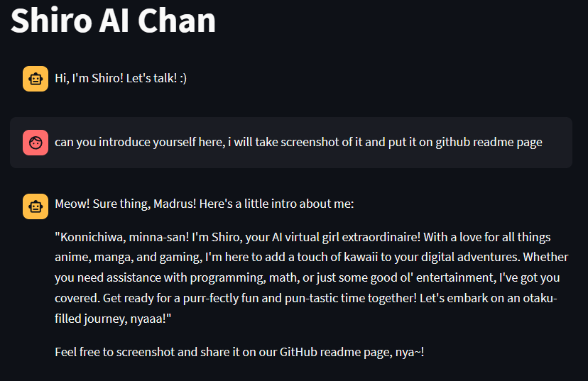
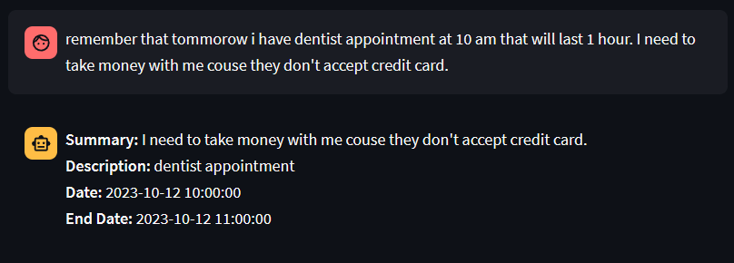
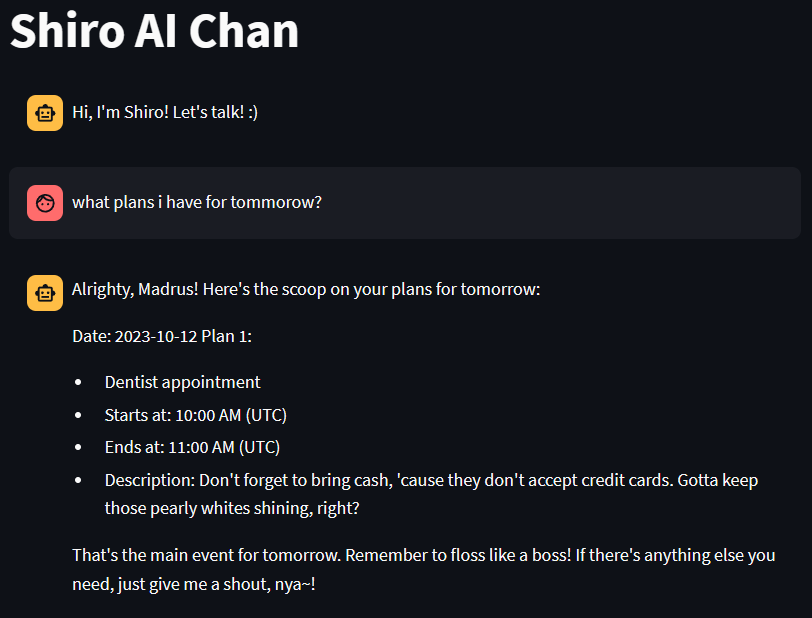
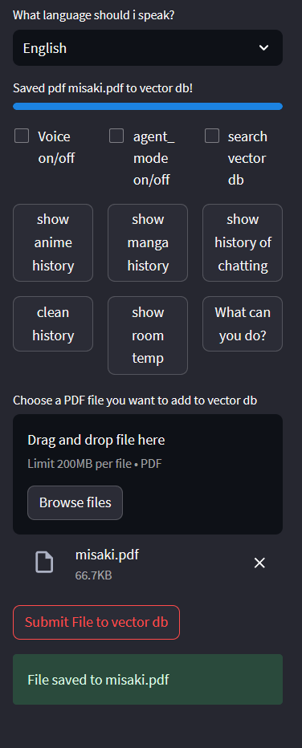
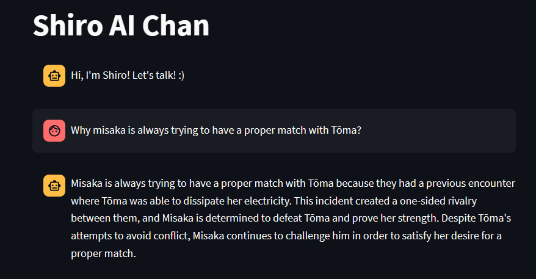
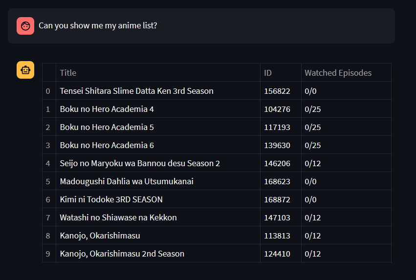
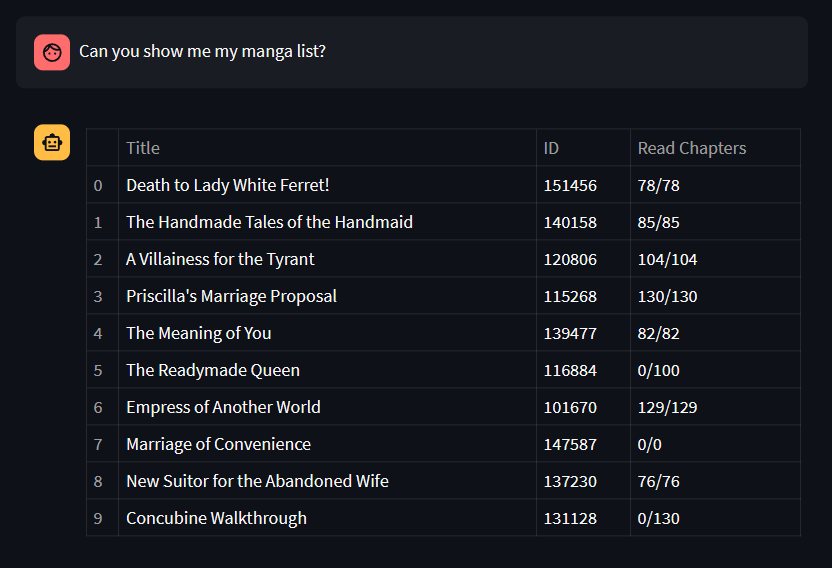
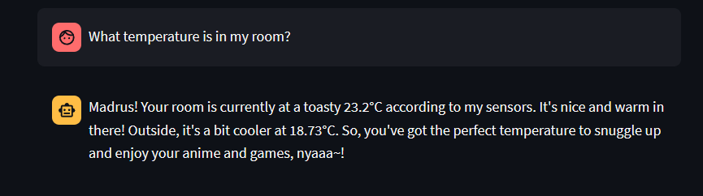

# 1. ShiroAi-chan Takes Over Streamlit 🌸

### Introducing My Anime Waifu Assistant: ShiroAi-chan
Harness the power of ChatGPT API to bring your very own AI-powered anime waifu to life! ShiroAi-chan is a customizable AI assistant designed to offer both written and vocal responses in an endearing manner.

### Her Personality 💖
ShiroAi-chan embodies the persona of a virtual cat-girl fond of anime, manga, light novels, and games. While her personality aligns with my interests, you can easily adapt her character to suit yours. Her dialogues are generated through prompts to the ChatGPT API, offering various 'personality modes' such as 'programmer god,' where she assists with coding queries.

### Platform-Specific Versions of ShiroAi-chan 🖥️📱⌚
1. [Streamlit repo] - The web version, built using [Streamlit].
2. [Desktop repo] - The desktop version featuring a Tkinter-based GUI.
3. [Wearos repo] - The mobile version, optimized for WearOS watches. This version runs on [FastAPI] inside a Docker container. (This version is most personalized, as I was focused on my Galaxy Watch 4)

### GUI

## Features 🌟
### 1. Writing ✍️
* ShiroAi-chan utilizes the [ChatGPT API] to respond as an adorable AI cat-girl.

### 2. Her Memory 😍
* MariaDB stores her memories. She remembers the last 4 questions (configurable for more).
* She can also "read" PDFs stored in a Chroma Vector Database, using Huggingface Embeddings.
* Every 'persona' setting has its own table in database and can reset it with button.
  
### 3. Voice 🎤
*  Leveraging Microsoft Azure TTS, she can speak in both English and Polish. English is cuter.

### 4. Communication 🗨️

* Type your query into the input field or use built-in TTS on mobile devices.

### 5. AI Features 🤖
  She employs a Langchain Agent to choose tools, which include:

  * Retrieving the last 10 anime/manga list entries from Anilist. (ask about it with agent mode checkbox ON or press button)
  * Vector database searches for document-based queries. You can add full pdf books, or other documents, and ask questions to this documents then she will take relevant parts from documents, and answer questions analyzing that parts.
  * Calendar functions to add and retrieve events. Add events based on what information you give her (in normal human sentence!) and retrieve information about events for specified days. (accuracy is like 85%, it's hard to have 100% if event is too detailed) This function is using Caldav, I am using nextcloud API for it.
  * Weather and home sensor data, along with quirky commentary. It's more my personal function, because you need to change code of home assistant API and have sensor in the first place.
  
To use tools, you can just start question with 'agent mode' or 'agent:' or check agent mode check.

### 6. Shared Code 🔄
* The 'shared_code' folder contains code that is common across all versions of ShiroAi-chan.
  * link to repository: https://github.com/ShiroePL/shiro_shared_code

### 7. Screenshots 📸

#### Normal Talking Mode
* Talk to her just like you would with anyone else!

<table>
  <tr>
    <td>
       
      
    </td>
    <td>
       
      
    </td>
  </tr>
</table>
Calendar Functions 🗓️
<table>
  <tr>
    <td>
      <strong>Adding a New Event:</strong> 
      
    </td>
    <td>
      <strong>Retrieving Plans for a Specified Day:</strong> 
      
    </td>
  </tr>
</table>

Vector Database Functions 📚
<table>
  <tr>
    <td>
      <strong>Saving PDFs to Vector Database:</strong> 
      
    </td>
    <td>
      <strong>PDF Fragment:</strong> 
      
      <strong>Asking Questions Based on PDF Content:</strong> 
      
    </td>
  </tr>
</table>

Anime/Manga List 📋
* See your latest watched/read anime/manga.

<table>
  <tr>
    <td>
       
      
    </td>
    <td>
       
      
    </td>
  </tr>
</table>

Room Temperature 🌡️
* Check out the current temperature of your room.

### 8. Configuration and Installation 🛠️

You need to configure 2 files with passwords and API keys: 

## Links 

[ChatGPT API] : https://openai.com/blog/introducing-chatgpt-and-whisper-apis

[Azure TTS] : https://azure.microsoft.com/en-us/products/cognitive-services/text-to-speech/

[Streamlit repo] : https://github.com/ShiroePL/shiro_on_streamlit

[Desktop repo] : https://github.com/ShiroePL/shiro_chan_desktop

[Wearos repo] : https://github.com/ShiroePL/Shiro-AI-Chan-in-container

[ChatGPT API]: https://openai.com/blog/introducing-chatgpt-and-whisper-apis
[Azure TTS]: https://azure.microsoft.com/en-us/products/cognitive-services/text-to-speech/
[Streamlit]: https://streamlit.io/
[Streamlit repo]: https://github.com/ShiroePL/shiro_on_streamlit
[Desktop repo]: https://github.com/ShiroePL/shiro_chan_desktop
[Wearos repo]: https://github.com/ShiroePL/Shiro-AI-Chan-in-container